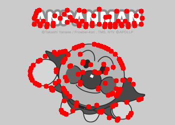
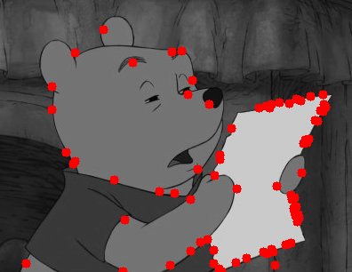

# Difference of Gaussians

## Part 1: Scale Invariant Feature Detection

* Implement Difference of Gaussian (**DoG**)
* Environment:
  * Python == 3.7
  * Numpy == 1.21.6
  * Opencv-python == 4.5.5.64
  * Python standard library

## Implement

* Step 1: Filter images with different sigma values (5 images per octave, 2 octave in total)
  * Octave 1
  * Octave 2: downsampling
* Step 2: Subtract 2 neighbor images to get DoG images (4 images per octave, 2 octave in total)
  * Function: cv2.subtract(second_image, first_image)
  * Subtract
  * Save DoG images
    * DoG1-1.png  
    
    * DoG1-2.png  
    
    * DoG1-3.png  
    
    * DoG1-4.png  
    

* Step 3: Thresholding the value and Find local extremum (local maximun and local minimum)
  * Keep local extremum as a keypoint
  * Turn List to image
  * Find local extremum
  * Thresholding
* Step 4: Delete duplicate keypoints
  * Function: np.unique
  * sort 2d-point by y, then by x

## Evaluate

Run the code to evaluate error points in command.

```bash
python val.py
```

Result needs to match Ground truth:

```text
[Info] All keypoints match.
```

## Main

Run the code to visualize DoG and plot feature points in command.

```bash
test.bash
```

Output the result to `out/test1` and `out/test2`.





### Test.bash

```bash
python main.py --threshold 3.0
mkdir out/test1
mv out/*.png out/test1

mkdir out/test2
python main.py --threshold 1.0 --image_path ./testdata/2.png
mkdir out/test2/thershold-1
mv out/*.png out/test2/thershold-1

python main.py --threshold 2.0 --image_path ./testdata/2.png
mkdir out/test2/thershold-2
mv out/*.png out/test2/thershold-2

python main.py --threshold 3.0 --image_path ./testdata/2.png
mkdir out/test2/thershold-3
mv out/*.png out/test2/thershold-3
```
