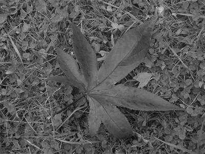
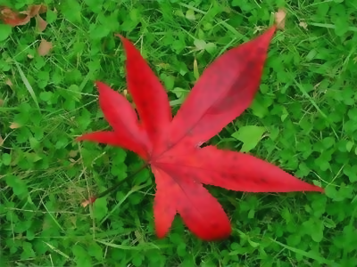

# Joint Bilateral Filter

## Part 2: Image Filtering

* Advanced color-to-gray conversion
* Implement bilateral filter
* Environment:
  * Python == 3.7
  * Numpy == 1.21.6
  * Opencv-python == 4.5.5.64
  * Python standard library

## Bilateral Filter

$I_p'=\frac{\sum_{q \in \Omega_p}G_s(p,q) \cdot G_r(T_p,T_q) \cdot I_q}{\sum_{q \in \Omega_p}G_s(p,q) \cdot G_r(T_p,T_q)}$

* $I_p$: Intensity of pixel $p$ of original image $I$
* $I_p'$: Intensity of pixel $p$ of filtered image $I'$
* $T_p$: Intensity of pixel $p$ of guidance image $T$
* $\Omega_p$: Window centered in pixel $p$
* $G_s$: Spatial kernel: $G_s(p,q)=e^{-\frac{(x_p-x_q)^2+(y_p-y_q)^2}{2\sigma_s^2}}$
* $G_r$: Range kernel: $G_r(T_p,T_q)=e^{-\frac{(T_p-T_q)^2}{2\sigma_r^2}}$

## Implement

* Padding images with windown size
* Setup a look-up table for spatial kernel
* Setup a look-up table for range kernel
* Compute the weight of range kernel by rolling the whole image
* Normalize [0,1] to [0, 255]

## Evaluate

Run the code to evaluate error with ground true in command.

```bash
python val.py
```

Result needs to match Ground truth:

```text
[Time] 0.4799 sec
[Error] Bilateral: 0
[Error] Joint bilateral: 0
```

## Main

There are $\sigma_s$, $\sigma_r$ and 5 groups of gray-conversion parameters in
the setting files. Generate 6 gray-scale images by those parameters and cv2.cvtColor().

Setting files:

```text
R,G,B
0.0,0.0,1.0
0.0,1.0,0.0
0.1,0.0,0.9
0.1,0.4,0.5
0.8,0.2,0.0
sigma_s,2,sigma_r,0.1
```

Use those gray-scale images as guidance to run joint bilateral
filter and compute the perceptual similarity.

* Use L1-norm as cost function
* Casting the image into np.int32 is needed to avoid overflow when subtraction.

Run the code to visualize JBF and show total cost in command.

```bash
test.bash
```

Output the result to `out/test1` and `out/test2`.

```text
Total Cost: [1207799. 1439568. 1305961. 1394216. 1279697. 1127913.] 
Min Cost: 5 Max Cost: 1
Total Cost: [183850.  77900.  86023. 188019. 128341. 110862.] 
Min Cost: 1 Max Cost: 3
```

### RGB Image


### Gray Images



### Bilateral Filter Images


### Joint Bilateral Filter Images



### Test.bash

```bash
python main.py --image_path ./testdata/1.png --setting_path ./testdata/1_setting.txt
mkdir out/test1
mv out/*.png out/test1 

python main.py --image_path ./testdata/2.png --setting_path ./testdata/2_setting.txt
mkdir out/test2
mv out/*.png out/test2 
```

## Reference

[Spheluo/Joint-Bilateral-Filter](https://github.com/Spheluo/Joint-Bilateral-Filter)

[wctu/bilateralfilter-numpy](https://github.com/wctu/bilateralfilter-numpy)
