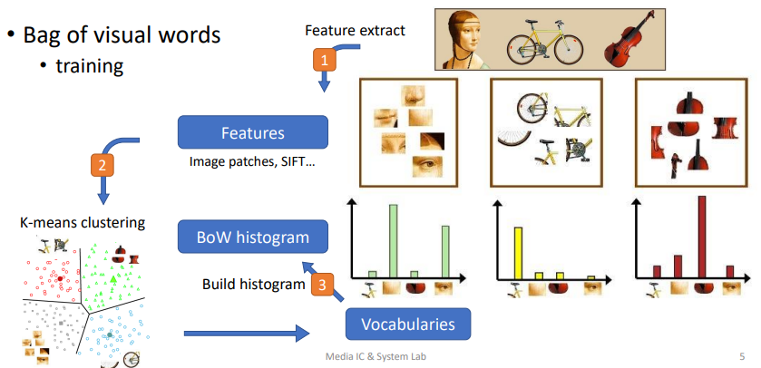
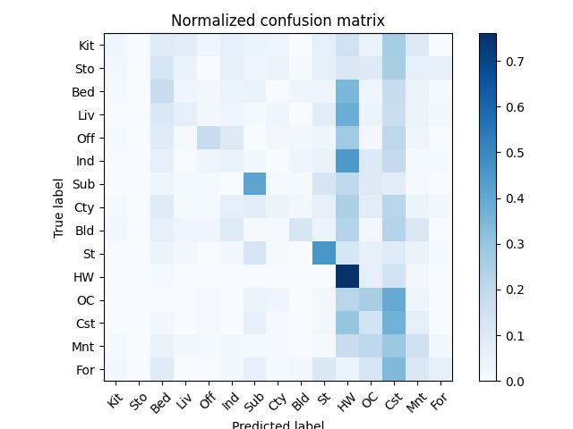
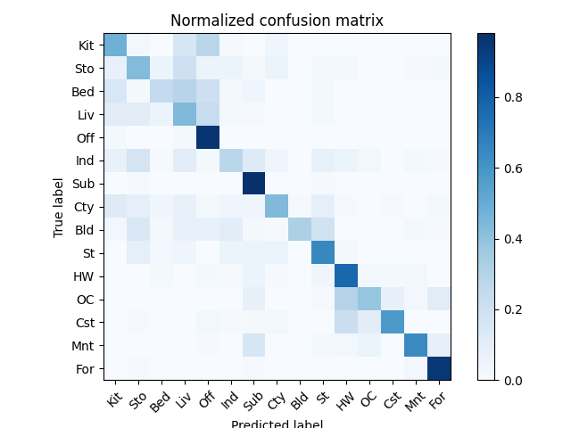

# Bag-of-Words Scene Recognition



## feature extraction

### 1. Tiny image

* get_tiny_iamges()

    1. simply resize the original image to a very small
    square resolution, e.g. 16x16. You can either resize
    the images to square while ignoring their aspect ratio
    or you can first crop the center square portion out of
    each image.
    2. flatten and normalize the resized image, making the
    tiny images unit length and zero mean, which will
    slightly increase the performance

### 2. Bag of SIFT

* build_vocabulary()

    1. create one list to collect features
    2. for each loaded image, get its 128-dim SIFT features (descriptors)
    and append them to this list
    3. perform k-means clustering on these tens of thousands of SIFT features
    The resulting centroids are now your visual word vocabulary

* get_bags_of_sifts()

    1. for each loaded image, get its 128-dim SIFT features (descriptors)
    in the same way you did in build_vocabulary()
    2. calculate the distances between these features and cluster centers
    3. assign each local feature to its nearest cluster center
    4. build a histogram indicating how many times each cluster presents
    5. normalize the histogram by number of features, since each image
    may be different

    These histograms are now the bag-of-sift feature of images.

## Hand-craft Classifier

* K-Nearest Neighbor (KNN)

    1. calculate the distance between training and testing features
    2. for each testing feature, select its k-nearest training features
    3. get these k training features' label id and vote for the final id

    Remember to convert final id's type back to string, you can use CAT
    and CAT2ID for conversion.

## Runs

Runs the bash file in termianl:

```bash
p1_run.sh
```

You can setting the vocab_size in ``p1.py``, larger values will work better (to a point) but be slower to compute.

## Result

### Confusion Matrix

* Tiny Image

    

* Bag of Sift

    

### Accuracy

```text
Accuracy
1. Tiny Image  => 0.210
2. Bag of Sift => 0.571
```
