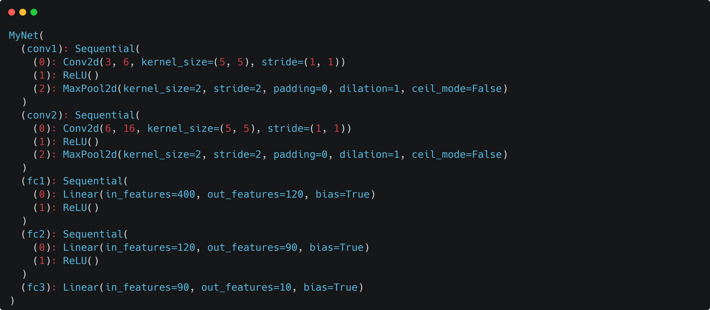
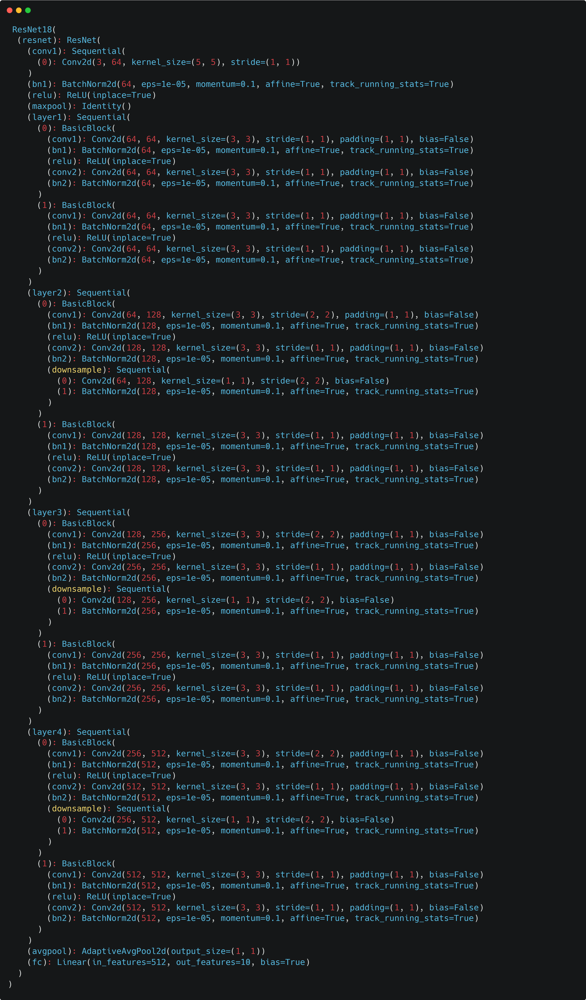
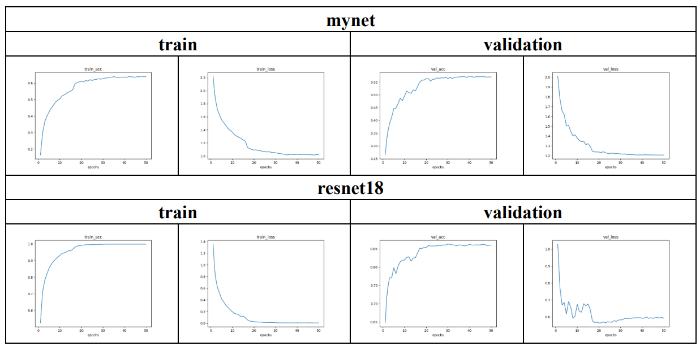

# CNN Image Classification

Image classification – predict a label for each image

* Input : RGB image
* Output : classification label

## Dataset

* train
  * 20000 images, 1 annotation file (w/ labels)
* val
  * 5000 images, 1 annotation file (w/ labels)
* unlabel
  * 30000 images, 1 annotation file (w/o labels)

### Dataloader

To improve the accuracy with data augmentation:

* HorizontalFlip
* VerticalFlip

```python
    if split == 'train':
        transform = transforms.Compose([
            transforms.Resize((32,32)),
            ##### TODO: Data Augmentation Begin #####
            transforms.RandomHorizontalFlip(p=0.5),
            transforms.RandomVerticalFlip(p=0.5),
            #transforms.GaussianBlur(3,3),
            ##### TODO: Data Augmentation End #####
            transforms.ToTensor(),
            transforms.Normalize(means,stds)
        ])
    else: # 'val' or 'test'
        transform = transforms.Compose([
            transforms.Resize((32,32)),
            # we usually don't apply data augmentation on test or val data
            transforms.ToTensor(),
            transforms.Normalize(means, stds)
        ])
```

## Models

### CNN model - **MyNet**



### ResNet18 model - **RestNet18**

To improve accuracy:

  1. reduce the kernel size, stride of the first convolution layer.
  2. remove the first maxpool layer (i.e. replace with Identity()).

```python
        # Improve the model #
        self.resnet.conv1 = nn.Sequential(nn.Conv2d(3,64,kernel_size=5, stride=1))
        self.resnet.maxpool = Identity()
        # Improve the model #
```



## Runs

Run bash files in terminal:

```bash
# for training
p2_run_train.sh
# for testing
p2_run_test.sh
```

## Result

### Accuracy

|Models      |   MyNet       |  Resnet18     |
|------------|---------------|---------------|
|Accuracy    |  0.5726       |  0.8626       |
|Time        |  52.36 sec(s) |  40.79 sec(s) |

### Learning curves (loss & accuracy)

